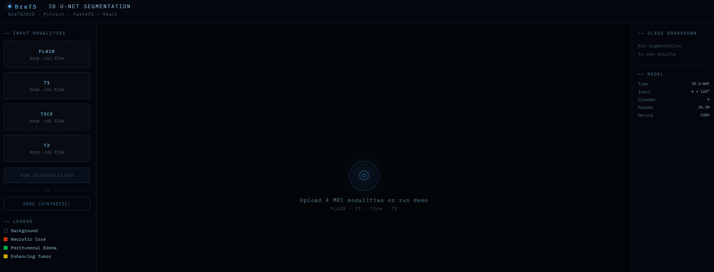

# 🧠 BraTS2020 Brain Tumor Segmentation

> 3D U-Net trained on BraTS2020 — full stack from raw MRI to live web app

## 📸 Screenshots

### Upload Panel


### Segmentation Results — Three Column Comparison


---

## 🔗 Links

| | |
|---|---|
| 🌐 **Live Demo** | https://brain-tumor-segmentation-with-bra-t.vercel.app |
| 🤗 **Backend API** | https://farahhamad-brats-segmentation.hf.space |
| 📖 **Medium Article** | https://medium.com/@farahabuhamad/understanding-and-processing-the-brain-tumor-segmentation-brats2020-dataset-98b67d303336 |
| 📊 **Dataset** | [BraTS2020 on Kaggle](https://www.kaggle.com/datasets/awsaf49/brats2020-training-data) |

---

## 🏗️ Architecture

```
Input: (B, 4, 128, 128, 128)   ← 4 MRI modalities stacked
           │
    ┌──────▼──────┐
    │  Encoder 1  │  32 filters   128³ → 64³   skip ──────────────────┐
    └──────┬──────┘                                                   │
    ┌──────▼──────┐                                                   │
    │  Encoder 2  │  64 filters    64³ → 32³   skip ─────────────┐    │
    └──────┬──────┘                                              │    │
    ┌──────▼──────┐                                              │    │
    │  Encoder 3  │  128 filters   32³ → 16³   skip ────────┐    │    │
    └──────┬──────┘                                         │    │    │
    ┌──────▼──────┐                                         │    │    │
    │  Encoder 4  │  256 filters   16³ →  8³   skip ───┐    │    │    │
    └──────┬──────┘                                    │    │    │    │
    ┌──────▼──────┐                                    │    │    │    │
    │ Bottleneck  │  512 filters    8³                 │    │    │    │
    └──────┬──────┘                                    │    │    │    │
    ┌──────▼──────┐                                    │    │    │    │
    │  Decoder 4  │ ◄── concat ────────────────────────┘    │    │    │
    └──────┬──────┘                                         │    │    │
    ┌──────▼──────┐                                         │    │    │
    │  Decoder 3  │ ◄── concat ─────────────────────────────┘    │    │
    └──────┬──────┘                                              │    │
    ┌──────▼──────┐                                              │    │
    │  Decoder 2  │ ◄── concat ──────────────────────────────────┘    │
    └──────┬──────┘                                                   │
    ┌──────▼──────┐                                                   │
    │  Decoder 1  │ ◄── concat ───────────────────────────────────────┘
    └──────┬──────┘
    ┌──────▼──────┐
    │  1×1×1 Head │  4 class logits
    └──────┬──────┘
           │
Output: (B, 4, 128, 128, 128)  ← per-voxel class logits
```

**Key design choices:**

| Component | Choice | Reason |
|-----------|--------|--------|
| Normalization | InstanceNorm3d | BatchNorm unstable at batch_size=1 |
| Activation | LeakyReLU(0.01) | Prevents dead neurons in deep network |
| Downsampling | Strided Conv3d | Learnable vs fixed MaxPool |
| Upsampling | Trilinear + concat | Preserves spatial detail via skip connections |
| Loss | Dice + CrossEntropy (50/50) | Dice handles imbalance, CE stabilizes gradients |
| Optimizer | AdamW | Adam + weight decay, prevents overfitting |
| LR Schedule | CosineAnnealingLR | Smooth decay over all epochs |
| Precision | AMP (float16) | 2× faster, halves VRAM at batch_size=1 |

---

## 📊 Training Results

### Dataset Split

| Split | Cases |
|-------|-------|
| Train | 295 (80%) |
| Val | 74 (20%) |

### MRI Modalities

| Modality | Description | Key information |
|----------|-------------|-----------------|
| FLAIR | Fluid-attenuated inversion recovery | Best for whole tumor extent |
| T1 | T1-weighted | Anatomical reference |
| T1ce | T1 with contrast enhancement | Best for enhancing tumor |
| T2 | T2-weighted | Best for peritumoral edema |

### Segmentation Classes

| Label | Region | Color |
|-------|--------|-------|
| 0 | Background | Black |
| 1 | Necrotic Core (NCR/NET) | 🔴 Red |
| 2 | Peritumoral Edema (ED) | 🟢 Green |
| 3 | Enhancing Tumor (ET) | 🟡 Yellow |

### BraTS Evaluation Regions

| Region | Definition | Clinical meaning |
|--------|-----------|-----------------|
| WT | Whole Tumor = {1,2,3} | Full tumor extent |
| TC | Tumor Core = {1,3} | Surgically resectable region |
| ET | Enhancing Tumor = {3} | Active tumor, prognostic indicator |

### Validation Dice Scores

| Epoch | Train Loss | Val Loss | WT | TC | ET | Mean |
|-------|-----------|----------|-----|-----|-----|------|
| 0 | 0.903 | 0.464 | 0.565 | 0.311 | 0.196 | 0.357 |
| 5 | 0.324 | 0.357 | 0.683 | 0.528 | 0.289 | 0.500 |
| **9** | **0.243** | **0.337** | **0.715** | **0.583** | **0.374** | **0.557** ← best |
| 109 | 0.173 | 0.355 | 0.705 | 0.556 | 0.366 | 0.543 |

Best checkpoint saved at **epoch 9**. The model started overfitting after epoch 9 — train loss continued to decrease but val loss increased. Adding data augmentation and dropout would push Mean Dice past 0.65+.

---

## 🗂️ Project Structure

```
Brain-Tumor-Segmentation-with-BraTS/
├── src/
│   ├── dataset.py          ← BraTSDataset — preprocessing pipeline + DataLoader
│   ├── model.py            ← UNet3D — 26.3M params, encoder/bottleneck/decoder
│   ├── train.py            ← training loop — loss, AMP, LR scheduling, checkpointing
│   └── inference.py        ← FastAPI backend — /health, /segment, /segment/demo
├── frontend/
│   ├── src/
│   │   ├── App.jsx         ← React UI — file upload, canvas rendering, results
│   │   └── index.css
│   ├── index.html
│   └── package.json
├── checkpoints/
│   └── best_model.pth      ← trained weights (epoch 9, Mean Dice 0.557)
├── Dockerfile              ← Docker setup for Hugging Face Spaces
├── requirements.txt
├── .env.example
└── .gitignore
```

---

## 🚀 How to Use the Website

Go to **https://brain-tumor-segmentation-with-bra-t.vercel.app**

### Option A — Upload Real MRI Files

1. Download any case from the [BraTS2020 dataset](https://www.kaggle.com/datasets/awsaf49/brats2020-training-data)
2. Upload each `.nii` file to its matching slot in the left panel:

| Slot | File |
|------|------|
| FLAIR | `BraTS20_Training_XXX_flair.nii` |
| T1 | `BraTS20_Training_XXX_t1.nii` |
| T1CE | `BraTS20_Training_XXX_t1ce.nii` |
| T2 | `BraTS20_Training_XXX_t2.nii` |

3. Click **RUN SEGMENTATION**
4. Wait ~2–5 minutes (CPU inference on Hugging Face free tier)
5. Switch between **Axial / Coronal / Sagittal** planes

### Option B — Demo Mode

Click **DEMO (SYNTHETIC)** to run inference on synthetic data with no upload needed.

### Reading the Results

```
┌──────────────────────────────────────────────────────────┐
│  FLAIR MRI        SEGMENTATION        OVERLAY            │
│  ┌────────┐       ┌────────┐          ┌────────┐         │
│  │ Raw    │       │ Color  │          │ Both   │         │
│  │ brain  │       │ tumor  │          │combined│         │
│  └────────┘       └────────┘          └────────┘         │
│                                                          │
│  [AXIAL]  [CORONAL]  [SAGITTAL]                          │
│                                                          │
│  Tumor burden: 2.385%                                    │
│  WT: 50,014 vox   TC: 11,170 vox   ET: 8,868 vox         │
└──────────────────────────────────────────────────────────┘
```

**Tumor burden** = percentage of brain volume occupied by tumor.  
**WT > TC > ET** is the expected nested hierarchy for glioma.

---

## 🛠️ Run Locally

### Prerequisites

- Python 3.11
- Node.js 18+
- CUDA GPU recommended

### 1 — Clone and install

```bash
git clone https://github.com/YOUR_USERNAME/Brain-Tumor-Segmentation-with-BraTS.git
cd Brain-Tumor-Segmentation-with-BraTS
pip install torch nibabel numpy fastapi uvicorn python-multipart python-dotenv
```

### 2 — Configure paths

```bash
cp .env.example .env
# Edit .env with your dataset path
```

### 3 — Start backend

```bash
cd src
python -m uvicorn inference:app --host 0.0.0.0 --port 8000 --reload
# Docs at http://localhost:8000/docs
```

### 4 — Start frontend

```bash
cd frontend
npm install
npm run dev
# App at http://localhost:5173
```

### 5 — Train from scratch (optional)

```bash
cd src
python train.py
# Monitor: python -m tensorboard.main --logdir checkpoints/logs
```

---

## 📐 Preprocessing Pipeline

```
Raw NIfTI (240×240×155, float64)
        ↓
Z-score normalization (brain voxels only, background stays 0)
        ↓
Bounding box crop (removes empty border slices)
        ↓
Trilinear resize → (128, 128, 128)
        ↓
Stack 4 modalities → (4, 128, 128, 128) float32 tensor
```

Segmentation masks use `nearest` neighbor resize to preserve integer label values. Label `4 → 3` remapped before resize (BraTS historical artifact).

---

## 📚 References

- Ronneberger et al. — [U-Net: Convolutional Networks for Biomedical Image Segmentation](https://arxiv.org/abs/1505.04597) (2015)
- Bakas et al. — [Advancing The Cancer Genome Atlas glioma MRI collections](https://www.nature.com/articles/sdata2017117) (2017)
- [BraTS2020 Challenge](https://www.med.upenn.edu/cbica/brats2020/)

---

## 📝 Medium Article

**[Understanding and Processing the Brain Tumor Segmentation (BraTS2020) Dataset](https://medium.com/@farahabuhamad/understanding-and-processing-the-brain-tumor-segmentation-brats2020-dataset-98b67d303336)**

---

## 📄 License

MIT License — free to use, modify, and distribute with attribution.

---

*Built with PyTorch · FastAPI · React · Vite · Hugging Face Spaces · Vercel*
